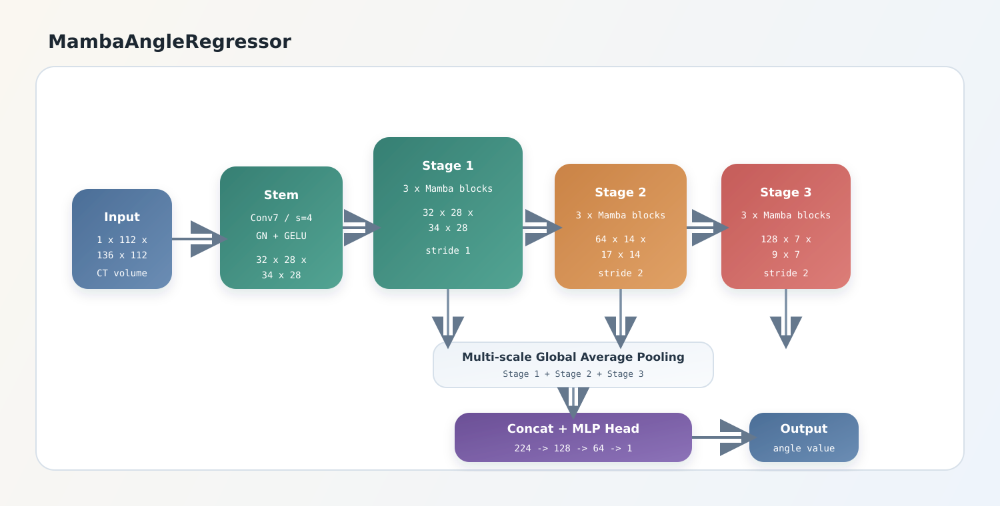
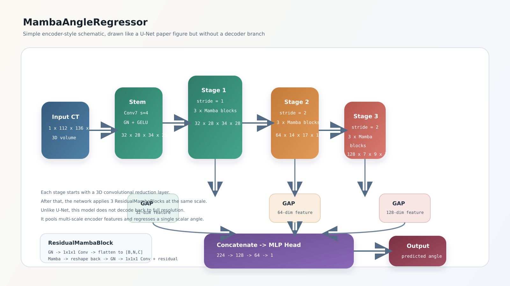
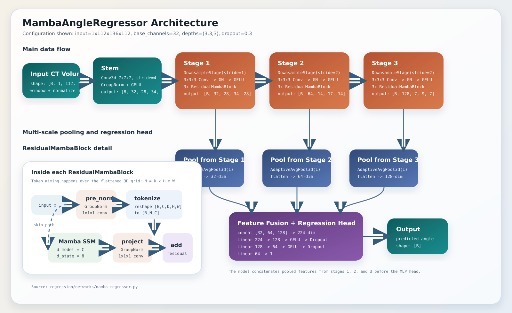

# MambaAngleRegressor Architecture

This diagram summarizes the current regression network defined in [mamba_regressor.py](/home/felix/Research/nnMamba/regression/networks/mamba_regressor.py).

It matches the default regression configuration:

- `in_channels=1`
- `base_channels=32`
- `blocks=3`, which becomes `depths=(3,3,3)`
- `dropout=0.3`
- input volume size `112x136x112`

Recommended paper-style version:



Older simple version:



Detailed version:



## Reading the diagram

- The stem reduces the input volume by `stride=4`, producing `32 x 28 x 34 x 28`.
- `Stage 1`, `Stage 2`, and `Stage 3` are `DownsampleStage`s, each composed of one convolutional reduction layer followed by `3` `ResidualMambaBlock`s.
- Each `ResidualMambaBlock` flattens the 3D spatial grid into a token sequence of shape `[B, N, C]`, applies `Mamba`, reshapes back to 3D, and adds the residual path.
- The model pools features from all three stages, concatenates them into a `224`-dimensional vector, and feeds that vector to the regression head.
- The final output is one scalar angle prediction per sample.

## Regenerating the paper figure

Run:

```bash
cd /home/felix/Research/nnMamba/regression
conda run -n nnMamba python scripts/generate_paper_architecture.py --config config.yaml
```

The script inspects the instantiated model structure and config, then writes:

- `regression/docs/assets/mamba_regressor_architecture_auto.svg`

The current auto-generated version is the recommended figure when you want a cleaner paper or slide overview without the extra explanatory annotations from the detailed variant.
